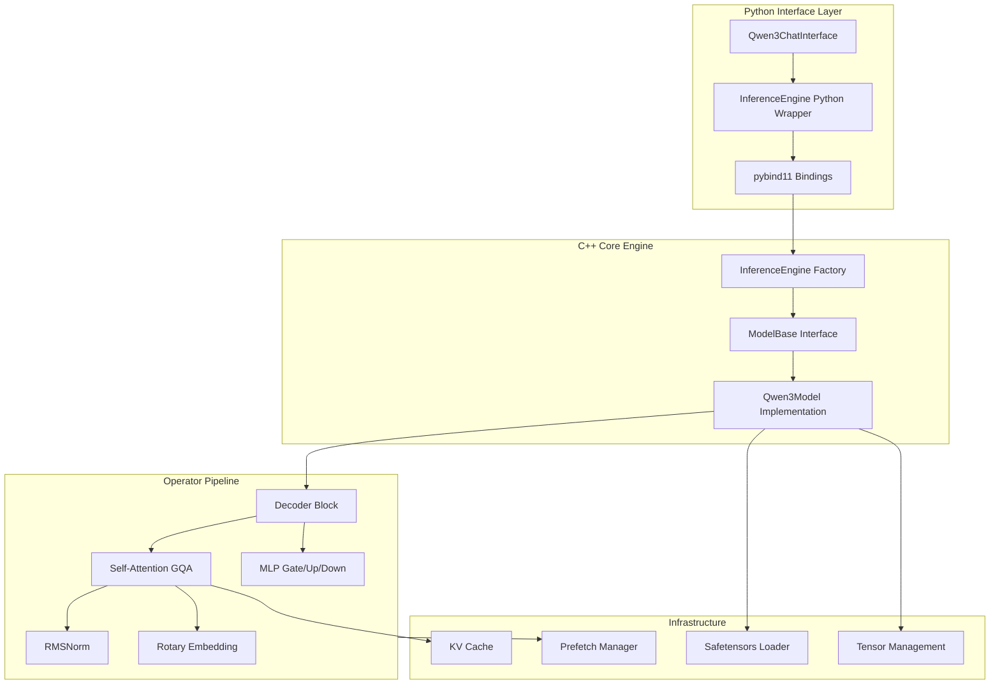
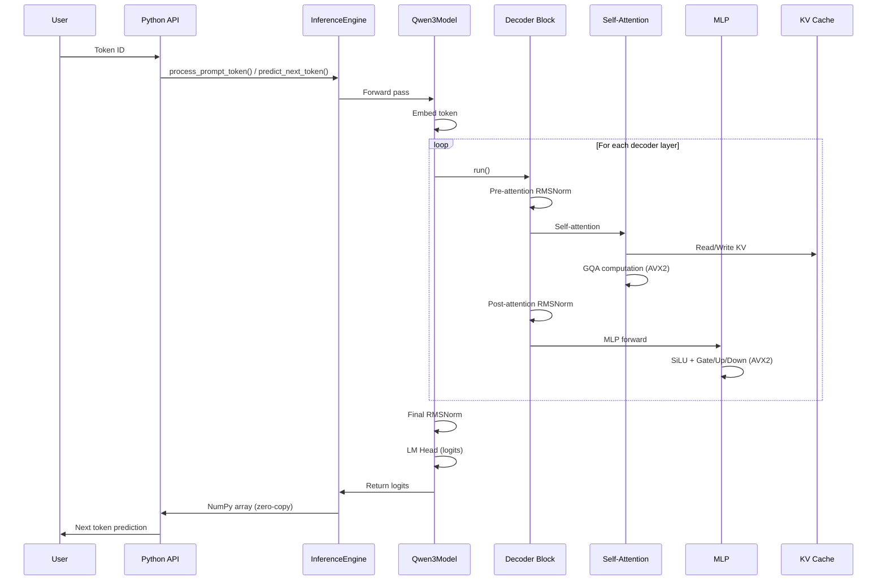

# MinMaxLLM

**High-Performance CPU Inference Engine for Large Language Models**

MinMaxLLM is a production-ready, CPU-optimized inference engine designed to run large language models efficiently on standard hardware. Built with C++ for maximum performance and Python for ease of use, it delivers GPU-quality inference on CPUs through advanced SIMD optimizations and memory-efficient design.

## 🚀 Key Features

- **⚡ AVX2-Optimized Operations**: Leverages Intel AVX2 SIMD instructions for 8x parallel processing of matrix operations, attention mechanisms, and normalization layers
- **💾 Memory-Efficient**: Memory-mapped I/O for instant model loading without full RAM consumption
- **🐍 Python-First API**: Zero-copy NumPy integration with intuitive Python interface, while computation runs in optimized C++
- **🔧 Production-Ready Architecture**: Modular operator-based design with comprehensive test coverage
- **🎯 Zero GPU Dependency**: Run state-of-the-art LLMs entirely on CPU hardware
- **📊 Streaming Generation**: Real-time token streaming with detailed performance metrics

## 🏗️ Architecture

MinMaxLLM follows a clean, modular architecture that separates concerns and enables easy extension:



### Inference Flow

The following diagram illustrates the token-by-token inference pipeline:



### Design Principles

1. **Operator-Based Modularity**: All operations inherit from `BaseOp`, enabling backend selection (NAIVE, AVX2, AVX512) and unified interface
2. **Model-Agnostic Engine**: `InferenceEngine` factory pattern supports multiple model families through polymorphic `ModelBase` interface
3. **Memory-Mapped Weights**: Safetensors loader supports both traditional loading and memory mapping for large models
4. **Efficient KV Cache**: Custom contiguous memory layout optimized for Grouped Query Attention (GQA)
5. **Zero-Copy Python Integration**: NumPy arrays share memory with C++ tensors, eliminating data duplication

## 📦 Supported Operations

### Core Transformer Operations

- **Self-Attention**: Grouped Query Attention (GQA) with AVX2-optimized dot products and softmax
- **MLP**: Multi-layer perceptron with SiLU activation, gate/up/down projections
- **Normalization**: RMSNorm with epsilon support
- **Position Embeddings**: Rotary Position Embedding (RoPE) with precomputed sin/cos caches
- **Element-wise Ops**: Addition and multiplication with OpenMP parallelization

### Performance Optimizations

- **AVX2 SIMD**: 8-wide vectorization for matmul, attention scores, normalization, and element-wise operations
- **Memory Mapping**: Zero-copy model weight loading using Windows memory-mapped files
- **Prefetch Manager**: Background thread prefetches weights into CPU cache before use
- **OpenMP Parallelization**: Multi-threaded execution for attention heads and batch operations
- **Optimized Memory Layout**: Contiguous KV cache storage for cache-friendly access patterns

## 🚀 Quick Start

### Prerequisites

- **Visual Studio 2022** (Community Edition or later) with C++ development tools
- **Python 3.12+** with pip
- **CMake 3.10+**
- **CPU with AVX2 support** (Intel Haswell/AMD Excavator or newer)

### Build Instructions

1. **Clone the repository**:
   ```bash
   git clone <repository-url>
   cd MinMaxLLM
   ```

2. **Install Python dependencies**:
   ```bash
   pip install -r requirements.txt
   ```

3. **Build the project**:
   ```powershell
   .\build.ps1
   ```
   
   For Debug builds or without AVX2:
   ```powershell
   .\build.ps1 -type Debug
   .\build.ps1 -noavx  # Disable AVX2 optimizations
   ```

4. **Verify the build**:
   The compiled extension module will be in `llm_inference/inference_engine.*.pyd` (Windows) or `*.so` (Linux).

### Usage Example

#### Interactive Chat Interface

```bash
python -m llm_inference.run_qwen3 model.safetensors --tokenizer-path /path/to/tokenizer
```

#### Python API

```python
from llm_inference import InferenceEngine, Qwen3ChatInterface
from transformers import AutoTokenizer

# Initialize engine
model = InferenceEngine("Qwen3-1.7B")
model.load_weights("model.safetensors", use_mmap=True)

# Load tokenizer
tokenizer = AutoTokenizer.from_pretrained("/path/to/tokenizer")

# Create chat interface
chat = Qwen3ChatInterface(model, tokenizer, max_new_tokens=512)

# Interactive chat
chat.chat_loop()
```

#### Low-Level API

```python
from llm_inference import InferenceEngine
import numpy as np

# Create and load model
engine = InferenceEngine("Qwen3-1.7B")
engine.load_weights("model.safetensors", use_mmap=True)

# Process prompt tokens
token_ids = [151643, 872, 525, 49932]  # Example token IDs
for token_id in token_ids[:-1]:
    engine.process_prompt_token(token_id)

# Generate next token
logits = engine.predict_next_token(token_ids[-1])
next_token = int(np.argmax(logits))

print(f"Predicted token: {next_token}")
```

## 📁 Project Structure

```
MinMaxLLM/
├── include/                 # C++ header files
│   ├── models/             # Model architecture definitions
│   │   ├── inference_engine.h
│   │   ├── model_base.h
│   │   └── qwen3model.h
│   ├── ops/                # Operator implementations
│   │   ├── base_op.h       # Base operator class
│   │   ├── decoder.h       # Transformer decoder block
│   │   ├── self_attention.h
│   │   ├── gqa.h           # Grouped Query Attention
│   │   ├── linear.h        # Linear/MatMul operations
│   │   ├── rmsnorm.h
│   │   ├── rotary_embedding.h
│   │   └── ...
│   └── tensor/             # Tensor and memory management
│       ├── tensor.h
│       ├── kvcache.h
│       └── safetensors.h
├── src/                    # C++ implementation files
│   ├── models/            # Model implementations
│   ├── ops/               # Operator implementations with AVX2
│   └── tensor/            # Tensor and cache implementations
├── llm_inference/         # Python package
│   ├── inference_engine.py    # Python wrapper
│   ├── chat_interface.py      # Chat interface base classes
│   └── run_qwen3.py           # CLI entry point
├── bindings/              # pybind11 bindings
│   └── inference_engine_bindings.cpp
├── tests/                 # Comprehensive test suite
│   ├── ops/              # Operator unit tests
│   ├── modules/          # Integration tests
│   └── tensor/           # Tensor tests
├── build.ps1              # Build script
├── CMakeLists.txt         # CMake configuration
└── requirements.txt       # Python dependencies
```

## 🎯 Current Status

### ✅ Implemented Features

- Full Qwen3 model support (1.7B and other sizes)
- Complete transformer operator stack
- AVX2-optimized core operations
- Memory-mapped safetensors loading
- Python bindings with zero-copy arrays
- Interactive chat interface with streaming
- Comprehensive test suite
- KV cache management
- Prefetch manager for cache optimization

### 🚧 Roadmap

Based on our development roadmap, upcoming features include:

- **Quantization**: 8-bit quantization for reduced memory footprint
- **Additional Model Families**: Support for LLaMA, Mistral, and other architectures
- **MLP Optimizations**: Fused gate/up projections and weight transpose optimizations
- **Memory Pooling**: Custom scratch memory allocator for reduced allocations
- **Advanced Sampling**: Top-k, top-p, and temperature-controlled sampling strategies
- **Device Abstraction**: `tensor.to(device)` support for future GPU/other device backends
- **Configurable Architectures**: Build any LLM from config (RoPE variants, attention types, etc.)
- **Performance Improvements**: Specialized kernels for M=1 matmul, further AVX2 optimizations

See [README_developer.md](README_developer.md) for detailed technical roadmap and TODOs.

## 🔬 Performance Characteristics

MinMaxLLM is optimized for CPU inference with the following characteristics:

- **Memory Efficiency**: Memory-mapped loading allows running models larger than available RAM
- **Single-Token Processing**: Optimized for autoregressive generation, processing one token at a time
- **Cache-Friendly**: Contiguous memory layouts and prefetching minimize cache misses
- **SIMD Acceleration**: AVX2 provides up to 8x speedup for vectorizable operations
- **Low Latency**: Optimized for interactive use cases with streaming token generation

### Performance Tips

- Use memory mapping (`use_mmap=True`) for large models to reduce initial load time
- Ensure your CPU supports AVX2 for optimal performance (most CPUs from 2013+)
- For best throughput, use CPUs with larger L3 cache
- Monitor memory usage with memory-mapped models to avoid swap thrashing

Performance varies by model size, hardware, and sequence length. For best results, use CPUs with AVX2 support and sufficient cache.

## 🧪 Testing

The project includes comprehensive tests for all components:

```powershell
# Run all tests
.\run_all_tests.ps1

# Individual test executables are in build/RelWithDebInfo/
```

Test coverage includes:
- Operator correctness (matmul, attention, normalization)
- Tensor operations and memory management
- KV cache functionality
- Safetensors loading
- End-to-end model inference

## 🤝 Contributing

Contributions are welcome! Areas of particular interest:

- Additional model architecture support
- Performance optimizations
- New operator implementations
- Test coverage improvements
- Documentation enhancements

Please ensure all tests pass and follow the existing code style.

## 📄 License

[Add license information here]

## 🙏 Acknowledgments

- Built with [pybind11](https://github.com/pybind/pybind11) for Python integration
- Uses [safetensors](https://github.com/huggingface/safetensors) format for model weights
- Compatible with [transformers](https://github.com/huggingface/transformers) tokenizers

---

**MinMaxLLM** - Bringing GPU-quality LLM inference to every CPU.
